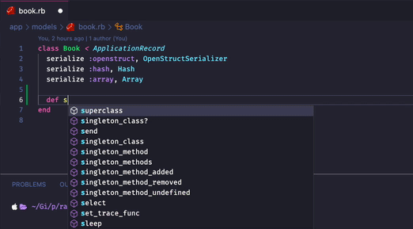
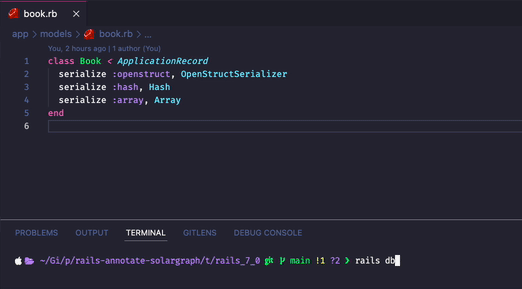

# Rails::Annotate::Solargraph


This gem is inspired by [ctran/annotate_models](https://github.com/ctran/annotate_models).

It automatically generates YARD comments for every model
in your Rails application. They're formatted in a way to make them easy
to parse for [Solargraph](https://solargraph.org/) (a great gem that serves
as a Ruby language server for your IDE).

Here's how you can generate and use these annotations.



They're automatically updated and generated when you execute migrations
in the development environment.



## Installation

Add this line to your application's Gemfile:

```ruby
gem 'rails-annotate-solargraph'
```

And then execute:

    $ bundle install

Or install it yourself as:

    $ gem install rails-annotate-solargraph

Then use this command to generate appropriate Rakefiles

    $ rails g annotate:solargraph:install


And you're ready to go!

Comments should be automatically added and
updated once you execute a migration.

## Usage

You can also manually generate or remove annotations.

### Annotate all models

    $ rake annotate:solargraph:generate

### Remove all annotations

    $ rake annotate:solargraph:remove

### Configure

You can change the gem's default configuration like so:

```ruby
# config/initializers/rails_annotate_solargraph.rb

if ::Rails.env.development?
    ::Rails::Annotate::Solargraph.configure do |conf|
        conf.annotation_position = :top # `:schema_file` by default
    end
end
```

#### annotation_position

There are a few values for this option:

- `:schema_file` -- default value, annotations get saved to a special file `.annotate_solargraph_schema`
- `:bottom` -- annotations are appended to the model files
- `:top` -- annotations are prepended to the model files

### Update

To update this gem you should generate the rakefiles once again. Overwrite them.

```sh
$ rails g annotate:solargraph:install
$ rake annotate:solargraph:remove
$ rake annotate:solargraph:generate
```

## Development

### Setup

To setup this gem for development you should use the setup script.

```sh
$ bin/setup
```

### Console

You can access an IRB with this entire gem preloaded like this

```sh
$ bin/console
```

### Tests

You can run all tests with:

```sh
$ rake test
```

All unit tests:

```sh
$ rake test:unit
```

All integration tests:

```sh
$ rake test:integration
```

### Release

To release a new version, update the version number in `version.rb`, and then run

```sh
$ bundle exec rake release
```

This will create a git tag for the version, push git commits and the created tag, and push the `.gem` file to [rubygems.org](https://rubygems.org).

### Local installation

To install this gem onto your local machine, run

```sh
$ bundle exec rake install
```

## Contributing

Bug reports and pull requests are welcome on Gitlab at https://gitlab.com/mateuszdrewniak/rails-annotate-solargraph.

## License

The gem is available as open source under the terms of the [MIT License](https://opensource.org/licenses/MIT).
